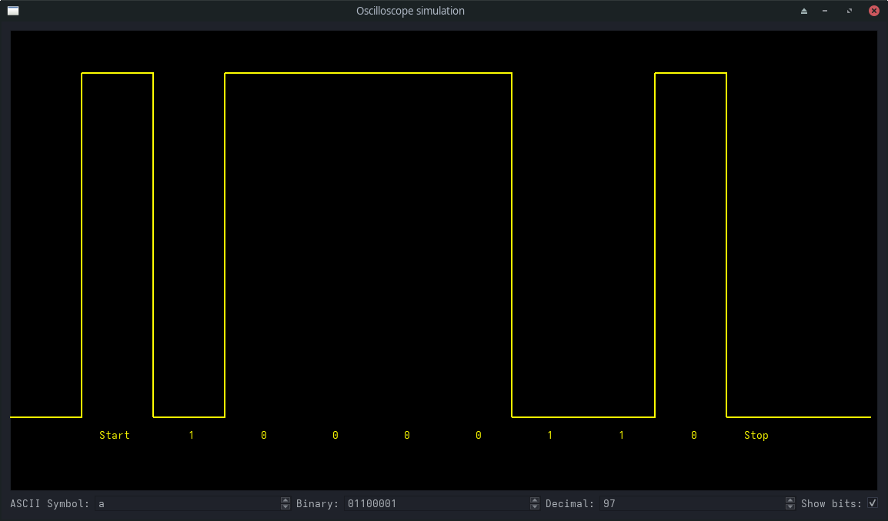

The fact that I chose to write a project to solve a university task as the only satisfying break between tutoring on weekend confirms that I need immediate psychotherapy for several years now.
Once again 

# ByteSign(al)-Visualizer
## an ASCII to RS232 parser

It processes only the first character that is input in the first (leftmost) text field.

Left to right, it begins with Start bit (LO), inverted byte of symbol in question and then End bit (HI).
